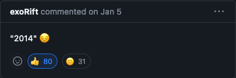
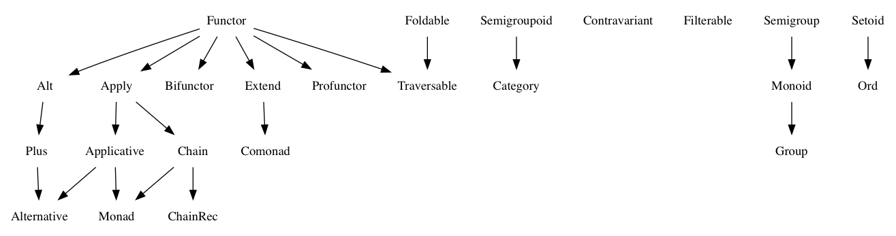

# 모나드 이해하기

- [모나드 이해하기](#모나드-이해하기)
  - [모나드](#모나드)
  - [타입 클래스](#타입-클래스)
    - [타입 클래스로써의 모나드](#타입-클래스로써의-모나드)
  - [고차 타입](#고차-타입)
  - [범주론](#범주론)
  - [판타지랜드 규격](#판타지랜드-규격)
  - [모나드 룰](#모나드-룰)

## 모나드

모나드는 수학의 범주론에서 나온 개념이다.  
책에서는 프로그래밍에서의 일종의 코드 설계 패턴으로, 몇 개의 인터페이스를 구현한 클래스라고 설명한다.  
함수형 프로그래밍에 관심을 가지게 되었을 때, 범주론까지 내려가 모나드의 엄밀한 정의부터 이해하기 위해 애를 썼었다.  
지금 생각해 보면 이 책의 설명처럼 그냥 이름이랑 아이디어만 가져온, 그냥 영감을 받아 만들어진 다른 개념이라고 생각하는 게 더 좋았을 것 같다.  
차라리 프로그래밍의 모나드를 일단 써보고 어느정도 익숙해진 후에 모나드의 수학적 정의를 공부하는 게 더 빠르고 쉽지 않았을까 싶다.

## 타입 클래스

타입 클래스는 어떤 타입이 특정 인터페이스를 구현하고 있다는 것을 보장하기 위해 사용한다.  
타입 클래스라는 말은 하스켈에서 나온 용어이다.  
하스켈의 클래스는 다른 OOP 언어의 클래스보다는 인터페이스에 가까운 개념이다.  
`trait` 개념이 있는 일부 언어는 `trait`를 이용해 타입 클래스를 구현하기도 한다.

### 타입 클래스로써의 모나드

다음과 같은 `callMap` 이라는 함수를 가정하자.

```ts
const callMap = (fn: Function) => (m: any) => m.map(fn);

const inc = (x: number) => x + 1;
const incMap = callMap(inc);
incMap([1]); // [2]: 정상 실행
incMap(1); // 에러: m.map is not a function
```

`callMap` 함수는 `m`이 `map` 메서드를 가지고 있어야 한다.  
따라서 `m: { map(fn: Function): any }` 라는 최소한의 타입 제한이 있어야한다.  
일반적인 OOP 로는 이를 `number` 타입에 `map` 메서드를 추가하는 방식으로 구현했을 것이다.  
하지만 하스켈은 이를 다음과 같은 `Monad` 라는 클래스를 구현하여 해결했다.

```ts
class Monad<T> {
  constructor(private __value: T) {}
  static of<U>(value: U): Monad<U> {
    return new Monad(value);
  }
  map<U>(fn: (x: T) => U): Monad<U> {
    return new Monad(fn(this.value));
  }
  get value(): T {
    return this.__value;
  }
}
```

이후 `callMap` 함수를 다음과 같은 `callMonad` 함수로 바꾸면 타입에 관계 없이 사용할 수 있다.

```ts
const callMonad =
  <T, U>(fn: (b: T) => U) =>
  (b: T) =>
    Monad.of(b).map(fn).value;

console.log(callMonad(inc)(1)); // 2
console.log(callMonad(map(inc))([1])); // [2]
```

이 `Monad` 처럼 타입에 상관 없이 만들 수 있는 클래스를 타입 클래스라고 한다.  
타입에 따른 안정성과 코드의 재사용성이 뛰어난 범용 함수를 만들 수 있다.

## 고차 타입

직전의 `Monad` 처럼 임의의 타입 `T` 를 한 단계 더 높은 타입으로 변환하는 용도의 타입을 고차 타입 이라고 한다.  
이 고차 타입도 범주론에서 처음 나온 개념이다.  
하지만 TS 에서는 `Monad<T>` 와 같은 2차 타입까지는 만들 수 있지만 3차 이상의 고차 타입은 만들 수 없다.  
이것도 모르고 고차 타입을 사용할 방법을 한참 찾다가 [관련 이슈](https://github.com/microsoft/TypeScript/issues/1213)가 거의 10년째 오픈 상태인 것을 발견했다...

ㅠㅠ

## 범주론

범주론이란 `범주`라는 개념과 그와 관련된 개념들을 다루는 학문이다.  
대체로 다음 그림으로 표현되곤 한다.

  
출처: [위키피디아](https://commons.wikimedia.org/wiki/File:Commutative_diagram_for_morphism.svg)

설명을 하려면 정말 할 말이 많지만 결론적으로 범주론은 두 집합 간의 자연스러운 대응을 다루는 학문이다.  
여기서 "자연스럽다"라는 표현은 두 집합 간의 구조가 보존된다는 의미이다.  
구조가 보존된다는 말은 단순히 집합 간 원소만을 대응시키는 것이 아니라, 원소 간의 관계, 함수와 사상까지도 대응시킨다는 의미이다.  
이전의 `Monad` 라는 클래스는 어떤 타입이든 자연스럽게 받아 다른 값을 만들어냈다.  
이처럼 자연스러운 대응, 변환을 만들어내는 것이 범주론의 목표이다.

## 판타지랜드 규격


[판타지랜드](https://github.com/fantasyland/fantasy-land) 규격은 하스켈의 `Prelude` 표준 라이브러리 구조를 JS 방식에 맞춰 재구성한 규격이다.  
이 규격을 따르는 라이브러리는 서로의 인터페이스를 구현한 클래스를 제공하므로, 이를 이용해 범용 함수를 만들 수 있다.  
이 규격은 다음과 같은 인터페이스[^인터페이스]를 제공한다.

[^인터페이스]: 판타지랜드는 TS 가 아닌 **JS** 를 위한 규격이므로, 인터페이스라는 단어는 정확하지 않을 수 있다.



여기서 화살표는 `extends` 를 의미한다.  
예를 들어 `Applicative` → `Monad` 는 `Monad extends Applicative`, `Monad` 이기 위해서는 `Applicative` 이어야 한다는 의미이다.  
이 규격을 따르는 라이브러리는 서로의 인터페이스를 구현한 클래스를 제공하므로, 이를 이용해 범용 함수를 만들 수 있다.  
이 그림에 따르면 판타지랜드 규격에 맞는 `Monad` 를 구현하기 위해서는 다음을 만족시켜야 한다, 혹은 다음 규격들을 만족하는 클래스는 `Monad` 인터페이스를 구현한 것이라고 할 수 있다.

- `Functor: { map(fn: Function): Functor }` [^Functor]
- `Apply: { ap(b: Apply): Apply } extends Functor`
- `Applicative: { of(value: any): Applicative } extends Apply`
- `Chain: { chain(fn: Function): Chain } extends Apply`

`Monad` 를 구현하기 위해서는 `Applicative` 과 `Chain` 을 구현해야 하고, `Applicative` 와 `Chain` 은 `Apply` 를 구현해야 하고, `Apply` 는 `Functor` 를 구현해야 한다.

[^Functor]: 참고로 Functor 라는 말은 함자라고 번역되며, 모나드처럼 범주론에서 나온 단어이다.

## 모나드 룰

추가적으로 임의의 클래스 `M` 이 `Monad` 이기 위해서는 다음과 같은 법칙을 따라야 한다.

- 왼쪽 법칙: `M.of(a).chain(f) === f(a)`
- 오른쪽 법칙: `m.chain(M.of) === m`

`of` 메소드는 `Applicative`, `chain` 메소드는 `Chain` 에서 구현한 것이기 때문에, `Monad` 를 구현시키기 위해서는 둘을 잘 연계되어야 한다.
